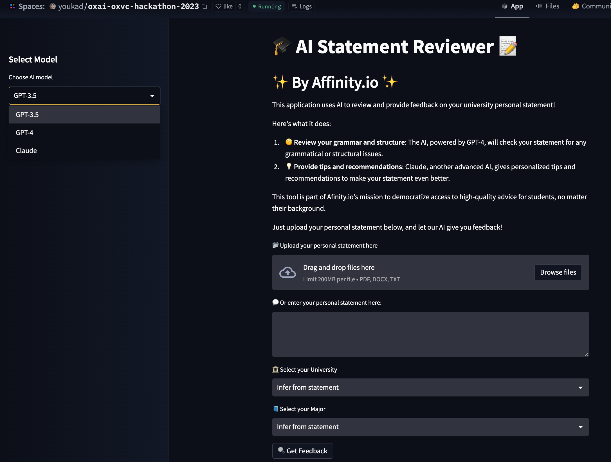

# OXVC x Creator Fund x OxAI Startup Hackathon
# AI Statement Reviewer

[](https://github.com/youqad/oxai-oxvc-hackathon-2023/)
[](https://huggingface.co/spaces/youkad/oxai-oxvc-hackathon-2023)
[](https://www.python.org/downloads/)
[](https://opensource.org/licenses/MIT)

[](https://docs.google.com/presentation/d/1qAX-VBRQs6WAwqB-ulv1hx280q969V1khsswykX9Fww/edit?usp=sharing)

AI Statement Reviewer is an application that uses advanced AI models to review and provide feedback on university personal statements. The app is designed to democratize access to high-quality personal statement advice, providing feedback that was previously only available to a select few. The ultimate goal is to enhance social mobility and level the playing field for all students, regardless of their background.

This application was developed for the "OXVC x Creator Fund x OxAI Startup Hackathon" in May 2023.



## Features

- Review grammar and structure: The AI, powered by GPT-4, will check your statement for any grammatical or structural issues.
- Provide tips and recommendations: Claude, another advanced AI, gives personalized tips and recommendations to make your statement even better.
- Support for multiple file formats: Upload your personal statement in PDF, DOCX, or TXT format.
- Customizable university and major selection: Choose your desired university and major for more personalized feedback.

## Installation

1. Clone the repository:

```
git clone https://github.com/youqad/oxai-oxvc-hackathon-2023/
```

2. Install the required packages:

```
pip install -r requirements.txt
```

3. Run the Streamlit app:

```
streamlit run app.py
```

## Usage

1. Upload your personal statement file (PDF, DOCX, or TXT) or enter your personal statement text in the provided text area.
2. Select your desired university and major from the dropdown menus.
3. Click the "Get Feedback" button to generate AI-driven feedback on your personal statement.

## Technologies Used

- [Streamlit](https://streamlit.io/) for creating the web application.
- [GPT-4](https://openai.com/) for generating grammar and structure feedback.
- [Claude](https://anthropic.com/) for providing tips and recommendations.
- [PyPDF2](https://pypi.org/project/PyPDF2/) and [python-docx](https://python-docx.readthedocs.io/en/latest/) for handling PDF and DOCX file formats.

## License

This project is licensed under the MIT License - see the [LICENSE](LICENSE) file for details.